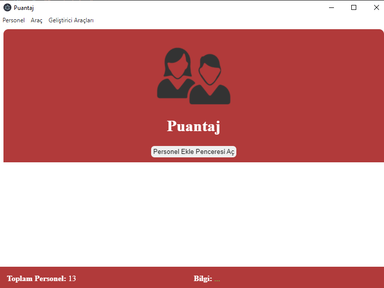
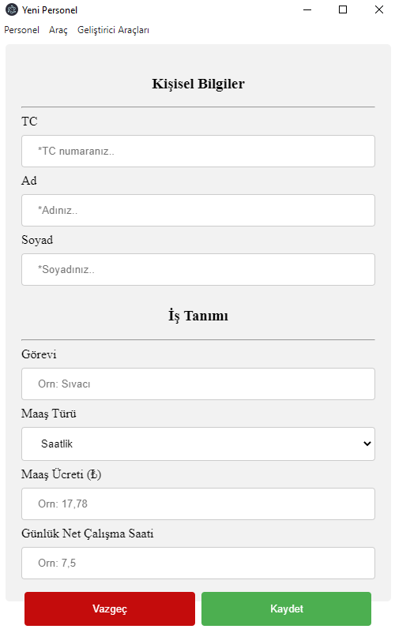
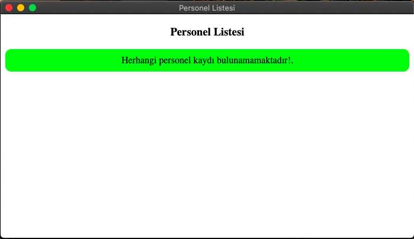
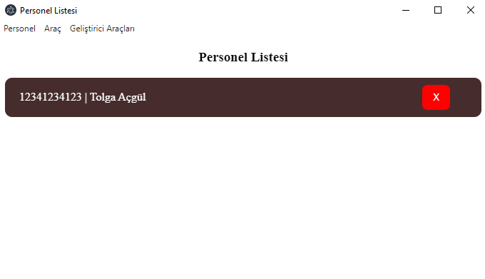

# Welcome to the 'Puantaj' Desktop Application

Merhaba, 
Bu **Puantaj** projesinde çalışanların maaş ve çalışma kayıtları tutulmaktadır. İstenildiğinde eleman ekleyebilir ve çıkarabilirsiniz.
Projede **NodeJS, ElectronJS ve JavaScript** teknolojileri kullanılmıştır. Veri tabanı olarak **MYSQL**  kullanılmıştır.

(Hello there,
In this **scoring** project, employees are kept on salary and invention. You can add and do this whenever you want.
**NodeJS, ElectronJS and JavaScript** technologies were used in the project. **MYSQL** is used as the database.)

## Usage
Bilgisayarınızda node.js kurulu olmalıdır. Kurulduğunu varsayarsak aşağıdaki adımları uygulayın:

**1-** Mevcut projenin klasör dizininde terminali açın. Sonra terminalde **npm install** yazın. Hepsi bu kadar. **package.json** içindeki gereksinimleri algılayıp yükleyecektir.

**2-** Çalıştığını test etmek için **npm start** komutunu kullanabilirisiniz.

**3-** Eğer Çalışmıyorsa bilgisayarınıza **mysql**'i kurmanız gerekebilir. **phpbyadmin** gibi araçları da indirip kurabilirsiniz. Varsa uzak sunucunuza da erişebilirsiniz. Bunlar için **assets/lib/connections.js** içerisindeki veritabanı bilgilerininizi girmeniz gerekemektedir. Veritabanı oluşturduktan daha sonra **personel** adında bir tablo oluşturup içerisine **tc,ad,soyad** kolonlarını ekleyin. Şimdi tekrar test edebilirsiniz.

**4-** Herşey mükemmel çalışıyorsa şimdi yaptığınız projeyi masaüstü **app** olarak çıkartabilirisiniz. Bunun için bilgisayarınızın işletim sistemine göre aşağıdaki komutlardan birini yazmanız yeterli olacaktır.

**npm run package-mac**
**npm run package-win**
**npm run package-linux**

(Node.js must be installed on your computer. Assuming it is installed, the following are:

**1 -** Find the terminal in the project's folder directory. Then type **npm install** in terminal. That is all. It will detect and install the requirements for **package.json**.

**2 -** You can use the **npm start** command to test it works.

**3 -** If it doesn't work you need to install **mysql**. You can also download and install tools such as **phpbyadmin**. You can also access your distance if available. For these, you do not need to enter your data information contained in **assets / lib / links.js**. After creating the database, create a table named **personal** and add **tc,ad,soyad** columns into it. You can now test it again.

**4 -** If everything works perfectly, you can now extract the project as desktop **app**. For this, it will be enough to type one of the following commands to forward it.

**npm run package-mac**
**npm run pack-win**
**npm run pack-linux**)

## İmages
#### Home

  

#### Adding Staff

  

#### List of staff

  

#### List of staff (Full)

  

